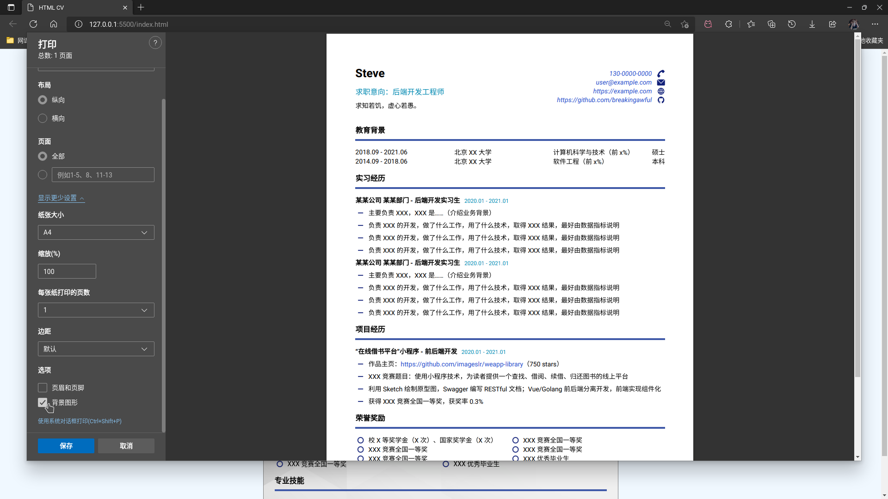

# HTML CV

一个 HTML 简历模板（正经人谁用 HTML 写简历啊）。

启发自 [💡【方法论】校招碎碎念 🔥](https://imageslr.com/2021/autumn-recruit.html#resume)。

## 使用

在浏览器界面使用打印功能保存为 PDF，确保选择了打印背景图形，否则图标不会加载。为了保证打印效果，已设置打印时不加载背景图片。

## 致谢

- [图标素材来自 iconfont](https://www.iconfont.cn)

- <a href='https://www.freepik.com/photos/sandstone'>Sandstone photo created by kues1 - www.freepik.com</a>

- <a href='https://www.freepik.com/vectors/modern-texture'>Modern texture vector created by rawpixel.com - www.freepik.com</a>

- <a href='https://www.freepik.com/vectors/abstract-liquid'>Abstract liquid vector created by rawpixel.com - www.freepik.com</a>

- <a href='https://www.freepik.com/vectors/abstract-stripes'>Abstract stripes vector created by Harryarts - www.freepik.com</a>

- <a href='https://www.freepik.com/photos/background-frame'>Background frame photo created by rawpixel.com - www.freepik.com</a>